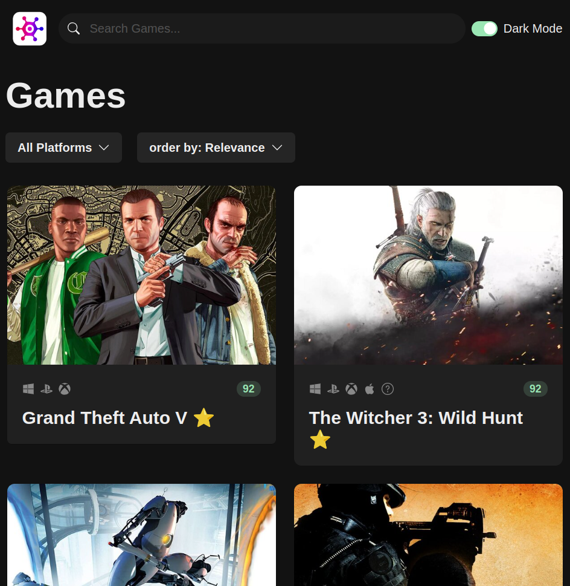
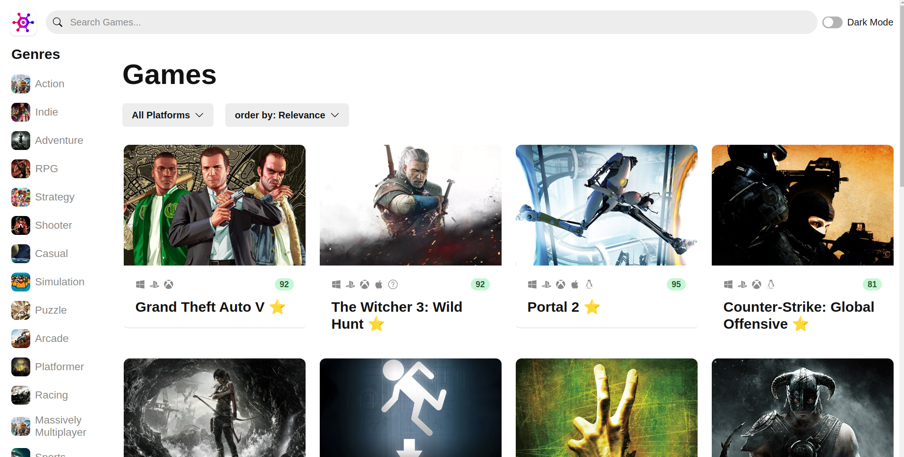

# GameHub

GameHub is a React-based web application that allows users to browse and search for video games. The application integrates with an external API to fetch game data.

## Features

- Browse a list of popular games
- Search for games by name
- View detailed information about each game
- Responsive design for mobile and desktop

## External API

This project uses the [RAWG Video Games Database API](https://rawg.io/apidocs) to fetch game data. The API provides detailed information about games, including descriptions, release dates, and ratings.

## Project Structure

The project is organized in a modular way to ensure maintainability and scalability:

- **Hooks**: Custom hooks are stored in the `hooks` directory, allowing for reusable logic across components.
- **API**: All API-related code is stored in the `api` directory, making it easy to manage and update API interactions.
- **Components**: UI components are stored in the `components` directory, promoting a clean and organized codebase.
- **Styles**: The application features a beautiful design, with styles organized in the `styles` directory.

## Usability and Thought Process

The application is designed with usability in mind:

- **User-Friendly Interface**: The interface is intuitive and easy to navigate, allowing users to quickly find and view information about their favorite games.
- **Responsive Design**: The application is fully responsive, ensuring a seamless experience on both mobile and desktop devices.
- **Modular Codebase**: The codebase is modular, making it easy to maintain and extend. Each piece of functionality is encapsulated in its own module, promoting code reuse and separation of concerns.
- **Performance Optimization**: The application uses efficient data fetching techniques and caching to ensure fast load times and a smooth user experience.

## Screenshots

Include screenshots of the application here to showcase its features and design.




## Installation

1. Clone the repository:
    ```bash
    git clone https://github.com/fkzx8000/Game_Hub_On_React.git
    ```
2. Navigate to the project directory:
    ```bash
    cd Game_Hub_On_React
    ```
3. Install the dependencies:
    ```bash
    npm install
    ```

## Usage

1. Obtain an API key from [RAWG](https://rawg.io/apidocs).
2. Create a `.env` file in the root directory and add your API key:
    ```env
    REACT_APP_RAWG_API_KEY=your_api_key_here
    ```
3. Start the development server:
    ```bash
    npm start
    ```
4. Open your browser and navigate to `http://localhost:3000`.

## Contributing

Contributions are welcome! Please open an issue or submit a pull request.

## License

This project is licensed under the MIT License.
